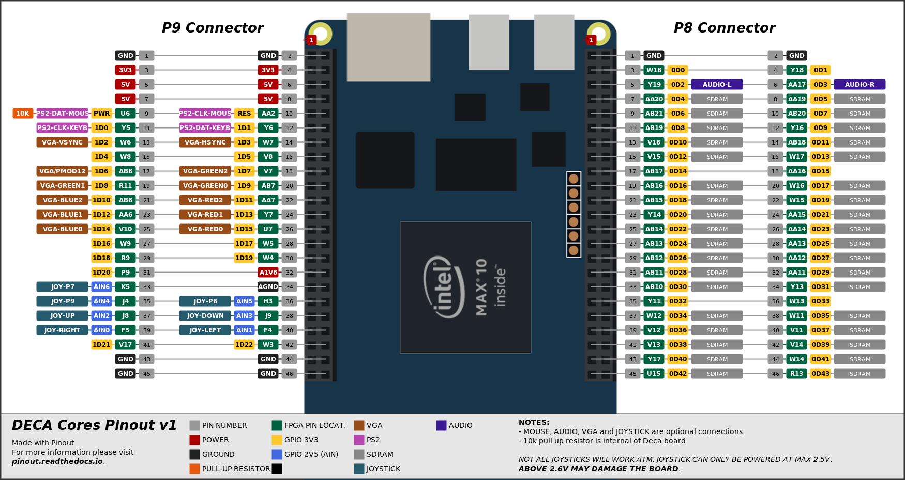

# NES - DECA port 

DECA Top level for NES by Somhic (16/07/21) adapted from DE10_lite port by Dar (https://sourceforge.net/projects/darfpga/files/Software%20VHDL/nes/)

**Features:**

* HDMI video output
* VGA video output is available through GPIO (see pinout below). Tested with PS2 & R2R VGA adapter (333)  https://www.waveshare.com/vga-ps2-board.htm
* Line out (3.5 jack green connector) and HDMI audio output
* PWM audio is available through GPIO (see pinout below)
* Joystick available through GPIO  (see pinout below).  **Joystick power pin must be 2.5 V**
  * **DANGER: Connecting power pin above 2.6 V may damage the FPGA**
  * This core is prepared for Megadrive 6 button gamepads as it outputs a permanent high level on pin 7 of DB9

**Additional hardware required**:

- SDRAM module. Tested with 32 MB SDRAM board for MiSTer (extra slim) XS_2.2 ([see connections](https://github.com/SoCFPGA-learning/DECA/tree/main/Projects/sdram_mister_deca)).
- PS/2 Keyboard connected to GPIO  (see pinout below)

**Versions**:

- current version: 5.1
- see changelog in top level file deca/nes_deca.sv

**Compiling:**

* Load project  in NES/deca/nes_deca.qpf
* sof/svf files already included in deca/output_files/

**Pinout connections:**



Mouse pinout is not used in this core.

**Others:**

* Button KEY0 is a reset button

### STATUS

* Working fine

* HDMI video outputs special resolution, so does not work in all monitors.


### Keyboard control 

- ESC key loads the OSD which controls NES options and load ROMS
- F1    : start
- F2    : select
- space : A
- ctrl  : B
- arrow up, down, left, right : move

### Changing how the core works

* HDMI output is 1026x480 because I had to double pixel clock to make it work in my monitor. I suggest you try changing following line in top project file nes_deca.sv to have a proper resolution of 513x480

  ```verilog
  assign HDMI_TX_CLK = clk;    // clk instead of clock_vga
  ```


After any change compile again in Quartus to generate a new bitstream. I used Quartus 17.1.

### Additional comments

See comments from DAR original port in top level file deca/nes_deca.sv